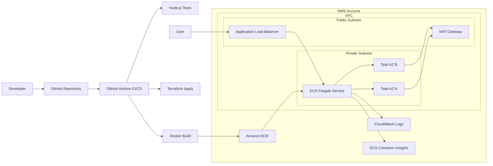

# DevOps Engineer Practical Challenge

This repository contains a production-shaped deployment for a simple HTTP service using Docker, Terraform, GitHub Actions, and AWS ECS Fargate.

## Architecture

The application runs as private ECS Fargate tasks across two Availability Zones. Public traffic enters through an Application Load Balancer. Container images are stored in Amazon ECR. Application logs are written to CloudWatch Logs, and ECS Container Insights is enabled for service-level metrics.



More detail is available in [docs/architecture.md](docs/architecture.md).

## What Is Included

- `src/server.js`: dependency-free Node.js HTTP service with `/`, `/health`, and `/ready` routes.
- `test/server.test.js`: basic service tests using the built-in Node test runner.
- `Dockerfile`: production container image running as a non-root user.
- `.github/workflows/deploy.yml`: CI/CD pipeline for test, Docker build, ECR push, Terraform apply, and ECS deployment.
- `terraform/envs/prod`: production Terraform root module.
- `terraform/modules/network`: VPC, public subnets, private subnets, NAT gateway, and routing.
- `terraform/modules/ecr`: ECR repository with scan-on-push and lifecycle policy.
- `terraform/modules/ecs_service`: ECS Fargate service, ALB, IAM roles, security groups, CloudWatch logs, and autoscaling.

## Local Development

Requirements:

- Node.js 20+
- Docker

Run tests:

```bash
npm test
```

Run the service locally:

```bash
npm start
```

Build the container:

```bash
docker build -t devops-practical-challenge:local .
```

Run the container:

```bash
docker run --rm -p 3000:3000 devops-practical-challenge:local
```

Health check:

```bash
curl http://localhost:3000/health
```

## Deployment

The pipeline deploys automatically on pushes to `main` and can also be started manually from the GitHub Actions UI.

### One-Time AWS Bootstrap

Create these before the first pipeline run:

- An S3 bucket for Terraform remote state.
- A DynamoDB table for Terraform state locking.
- A GitHub OIDC IAM role that the workflow can assume.

The IAM role should allow the infrastructure actions needed to manage VPC, ECS, ECR, ALB, IAM roles for ECS tasks, CloudWatch Logs, Application Auto Scaling, and related resources. In a real organization this should be scoped to this repository, environment, region, and resource naming convention.

### GitHub Configuration

Set these repository secrets:

- `AWS_ROLE_TO_ASSUME`: IAM role ARN used by GitHub Actions.
- `TF_STATE_BUCKET`: S3 bucket name for Terraform state.
- `TF_LOCK_TABLE`: DynamoDB table name for Terraform locking.

Set this repository variable:

- `AWS_REGION`: AWS region, for example `us-east-1`.

### Pipeline Flow

1. Check out the code.
2. Run Node.js tests.
3. Build the Docker image.
4. Configure AWS credentials through GitHub OIDC.
5. Initialize Terraform using the S3 backend.
6. Create or update the ECR repository.
7. Push the image tagged with the Git commit SHA.
8. Apply Terraform with `image_tag` set to the commit SHA.
9. ECS starts a new task definition revision and rolls traffic through the ALB.

## Manual Terraform Usage

From `terraform/envs/prod`, initialize Terraform with backend configuration:

```bash
terraform init \
  -backend-config="bucket=<state-bucket>" \
  -backend-config="key=devops-practical-challenge/prod.tfstate" \
  -backend-config="region=<aws-region>" \
  -backend-config="dynamodb_table=<lock-table>" \
  -backend-config="encrypt=true"
```

Review the plan:

```bash
terraform plan -var="aws_region=<aws-region>" -var="image_tag=<image-tag>"
```

Apply:

```bash
terraform apply -var="aws_region=<aws-region>" -var="image_tag=<image-tag>"
```

## Design Decisions

- ECS Fargate was selected over EC2 and EKS to reduce operational overhead while still supporting a production-style container deployment.
- The service runs in private subnets. Only the ALB is internet-facing.
- Docker images are immutable at deployment time because the ECS task definition receives the Git commit SHA as the image tag.
- Terraform modules separate network, registry, and service concerns for reuse and clearer review.
- CloudWatch Logs and ECS Container Insights provide basic logging and monitoring without adding another platform.
- GitHub Actions was selected for CI/CD because it is directly tied to repository events and supports AWS OIDC authentication without static AWS keys.

## Assumptions

- The target AWS account has sufficient service quotas for VPC, NAT Gateway, ALB, ECS, ECR, IAM, and CloudWatch resources.
- The first deployment is allowed to create networking and IAM resources.
- HTTP on port 80 is acceptable for the challenge. Production internet traffic should use HTTPS with ACM and an ALB HTTPS listener.
- Terraform state backend resources are bootstrapped once outside this project.

## Limitations and Improvements

- Add HTTPS with ACM, Route 53 DNS, and HTTP-to-HTTPS redirect.
- Add CloudWatch alarms for ALB 5xx errors, target health, ECS CPU, memory, and task restarts.
- Add vulnerability gating for ECR scan results.
- Add separate `dev`, `staging`, and `prod` environments.
- Add least-privilege IAM policy examples for the GitHub deployment role.
- Add blue/green deployments with CodeDeploy for stricter rollout control.
