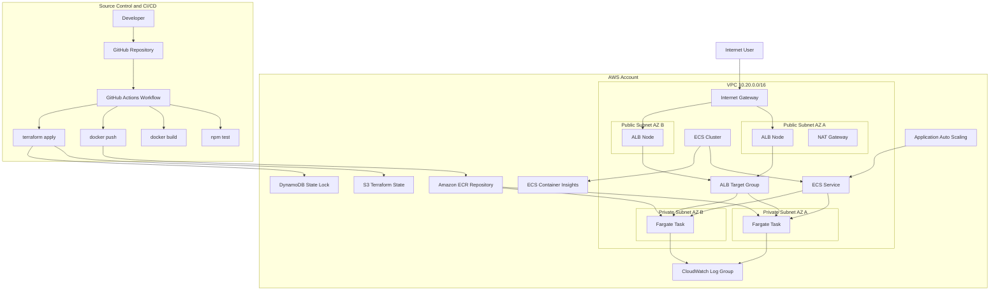

# Architecture Diagram

## Request Flow

1. A user sends an HTTP request to the public ALB DNS name.
2. The ALB routes the request to healthy ECS tasks in private subnets.
3. The Node.js service responds and writes structured JSON logs to stdout.
4. The ECS awslogs driver sends container logs to CloudWatch Logs.
5. ECS Container Insights publishes service metrics for basic operational visibility.

## Deployment Flow

1. A commit to `main` starts the GitHub Actions workflow.
2. Tests run before any deployment work.
3. Terraform ensures ECR exists.
4. The workflow builds and pushes a commit-tagged Docker image.
5. Terraform applies the ECS task definition update using the new image tag.
6. ECS performs a rolling deployment behind the ALB.
